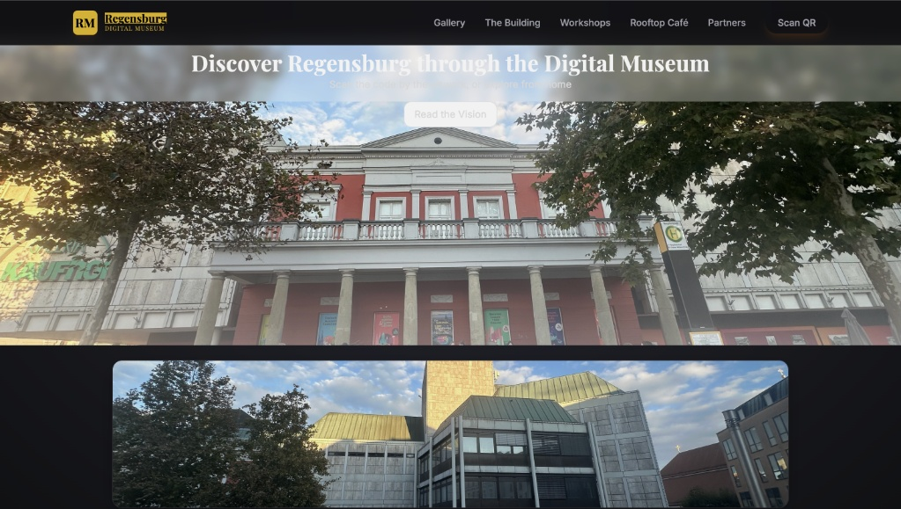
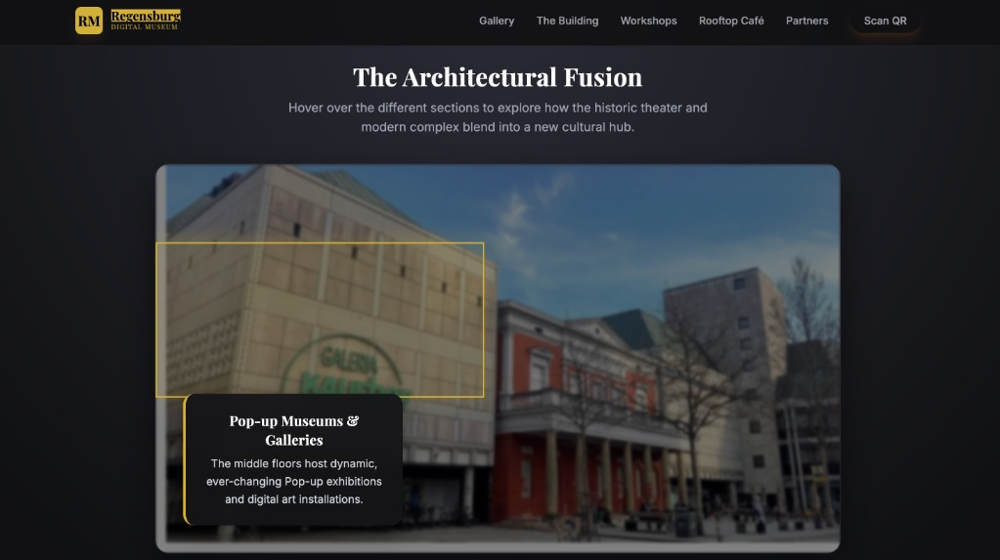
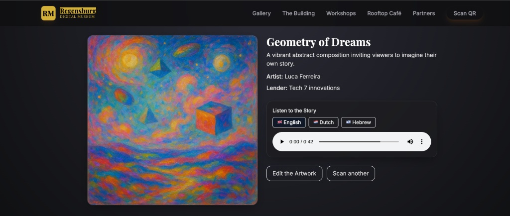
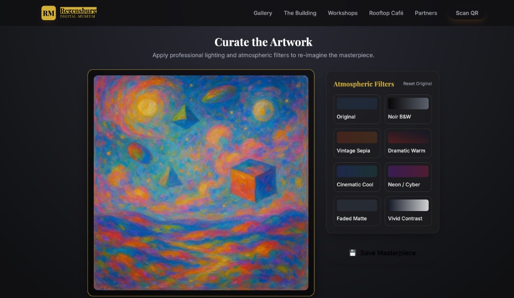
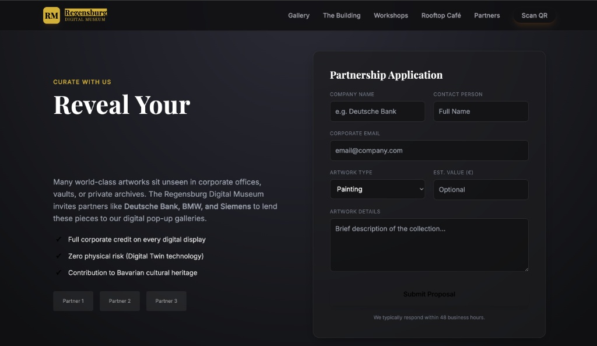
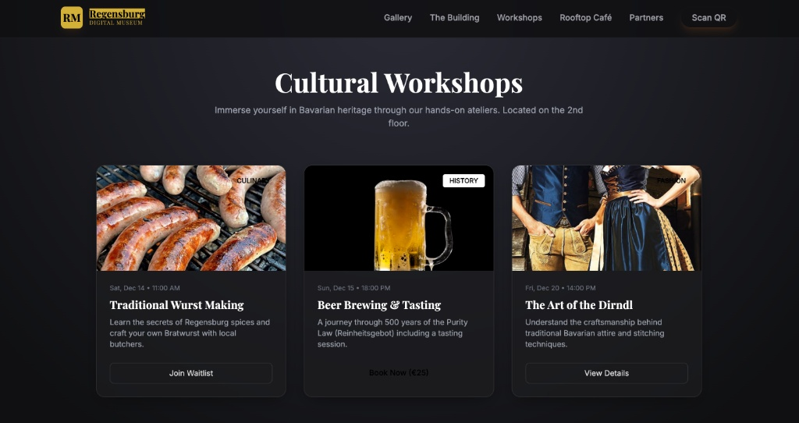
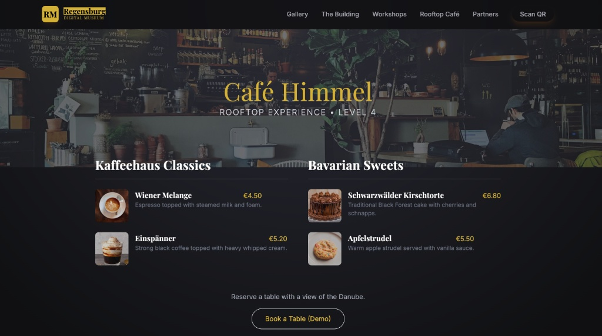

# 🏛️ Regensburg Digital Museum Platform

> **A "Phygital" (Physical + Digital) museum experience designed to bridge historical heritage with modern interactive technology.**

## 📖 Overview

The **Regensburg Digital Museum** is a high-performance web platform designed for an international competition. It transforms a traditional museum visit into an interactive journey. The project focuses on **User Experience (UX)**, **Performance**, and **Business Viability** by integrating features like AR-style scanning, art remixing, and corporate partnership management.

**Key Objective:** To attract younger audiences and corporate partners to the cultural heart of Regensburg through a seamless digital layer.

---

## 📸 Interface Gallery

### 🏠 The "Phygital" Gateway (Home & Building)
The landing page connects the physical theater building with its digital twin. Users can interactively explore floors via a visual map, discovering pop-up galleries and hidden spaces.

| Home Page | Interactive Structure Map |
|:---:|:---:|
|  |  |

### 🎨 Interactive Art & Remix Engine
A zero-latency, client-side editor allowing visitors to "remix" famous artworks using atmospheric filters (Noir, Cyberpunk, Vintage). It features multi-language audio guides (EN, DE, HE).

| Artwork Details & Audio | Real-time Canvas Editor |
|:---:|:---:|
|  |  |

### 💼 Business & Culture Modules
To ensure economic viability, the platform includes modules for corporate partnerships ("Hidden Treasures" program), cultural workshops, and the rooftop culinary experience.

| Corporate Partners Portal | Cultural Workshops | Rooftop Café Menu |
|:---:|:---:|:---:|
|  |  |  |

---

### Tech Stack
Backend: Python FastAPI (chosen for its async capabilities and speed).

Frontend: Server-Side Rendering with Jinja2, styled with TailwindCSS via CDN for rapid prototyping.

Interactivity: Vanilla JavaScript (Canvas API) for image processing on the client side (Zero-latency editing).

Data: JSON-based flat-file database (Optimized for read-heavy operations in a prototype environment).

🚀 Key Features
⚡ Zero-Latency Editing: The "Remix" feature processes images directly in the browser using the Canvas API, avoiding expensive server round-trips.

🌍 Multi-Language Support: Built-in audio guide toggles for English, German, and Hebrew to support international tourism.

📱 Mobile-First Design: All interfaces, including the partnership forms and workshop booking, are optimized for touch devices.

🏢 Business Integration: Dedicated flows for B2B partnerships (lending art) and B2C revenue streams (workshops/café).